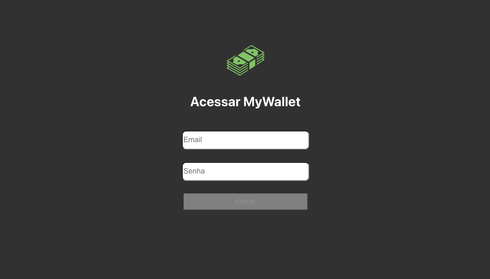
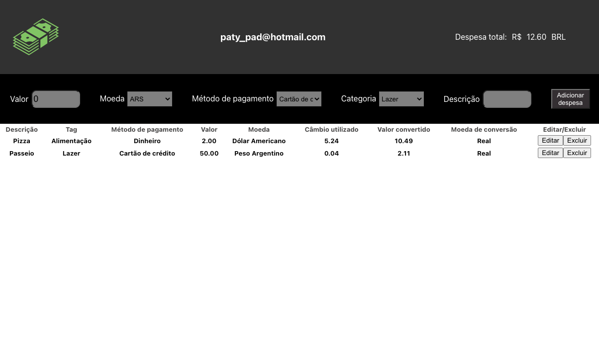

## MyWallet

### Projeto realizado durante o módulo de Front-end na Trybe 💚

### Tecnologias utilizadas:

  
  
  
  

---

### Sobre o desenvolvimento:
Foi um projeto desenvolvido individualmente, consumir os dados da API do [awesomeapi API de Cotações](https://economia.awesomeapi.com.br/json/all).

Neste projeto foi desenvolvida uma carteira de controle de gastos com conversor de moedas, ao utilizar essa aplicação o usuário é ser capaz de:

* Adicionar, remover e editar um gasto;
* Visualizar uma tabelas com seus gastos;
* Visualizar o total de gastos convertidos para uma moeda de escolha;

[Deploy do projeto - MyWallet](https://my-wallet-henna.vercel.app/) 

